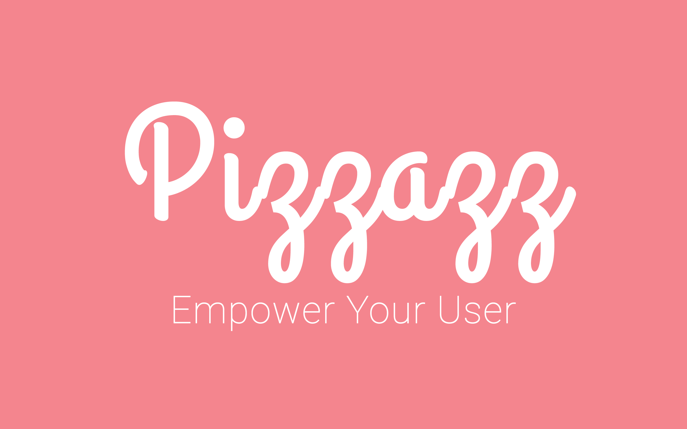

# Pizzazz
:stuck_out_tongue: A design tool that dynamically generates color schemes and design recommendations for user-generated content

## Inspiration

Behind each design a designer makes exists a purpose and intent. While developing our previous idea, an automated idea board that provides you with inspiration based on semantic keywords, we realized there is no solution to dynamically create pleasing color schemes for arbitrary colors. Pizzazz is that solution.

## What it does

Pizzazz is a robust API that is built to dynamically adapt your interface to match user-generated content. It makes the lives of developers easier by providing a tool for generating color schemes, and design recommendations effortlessly.

## How we built it

It is built using a Node.JS server that runs algorithms to determine the right combinations to “pizzazz” your life. The frontend uses SASS and jQuery, with Foundation powering the grid layout.

## Challenges we ran into

Integration of separately developed modules is often times the most difficult part of projects. Pizzazz was no exception. The process of linking the front-end with the back-end led us discover a great deal of problems with each of our codes and required a number of quick’n’dirty changes to get right.

## Accomplishments that we’re proud of

Our design tool wouldn’t be perfect if it didn’t have a crisp and beautiful design. And it does.

In addition, it is our first time working as a team. We accomplished a great deal when taking into account that we pivoted to this idea in the last third of the hackathon.

## What we learned

We learned that it’s better to go to a hackathon with a more solid idea of what we wanted to do. In addition, a hacks in the intersection of two areas (design & development) have great potential.

## What's next for Pizzazz

Pizzazz is a tool for developing color schemas to match user-generated content. Next steps include API endpoints to analyze images and videos to extract dominant colors and create color schemas based on that.

The future of Pizzazz also lies in semantic driven design. We wish to instantly create color schemas based on semantic keywords. Imagine querying an api with “royal” or “modern” and getting relevant color sets.

